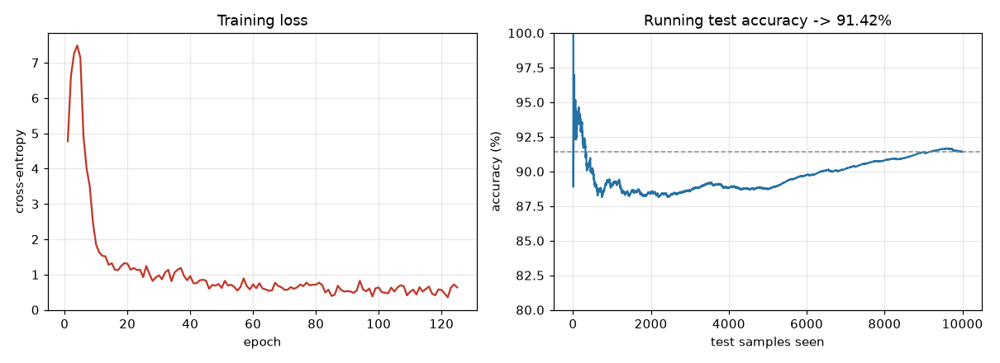
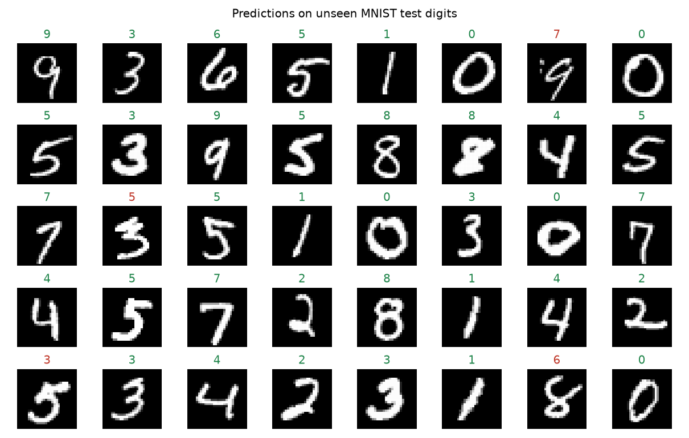
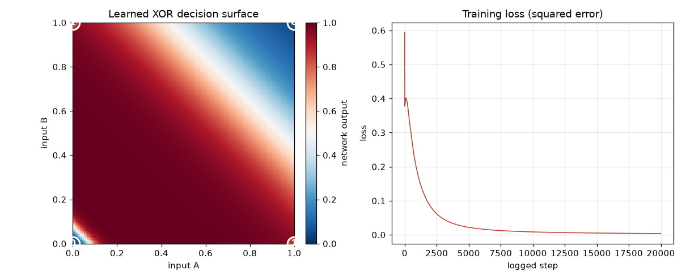

[![Contributors][contributors-shield]][contributors-url]
[![Forks][forks-shield]][forks-url]
[![Stargazers][stars-shield]][stars-url]
[![MIT][license-shield]][license-url]

<!-- PROJECT LOGO -->
<div align="center">
<h3 align="center">neural-nets-from-scratch</h3>
  <p align="center">
    Learning neural networks from first principles, in raw numpy (2019-2023)
  </p>
</div>

> **Archive notice:** This is a high-school-era learning archive. The code is preserved as it was
> written, warts included; a few surgical fixes were applied at publication time (2026) so the
> flagship scripts run on modern Python/numpy - each is marked with an `archive fix (2026)` comment.
> The figures below were regenerated from this code on Python 3.12.

## About The Project

This repository traces how I taught myself neural networks from scratch, starting in August 2019.
No frameworks - every forward pass, backprop derivation, and gradient update is hand-rolled numpy.

The arc, in chronological order: **XOR** (the first working net) → **MNIST digit classifier** (the
flagship) → an unfinished **CNN**.

## Results

### MNIST digit classifier

A from-scratch mini-batch-gradient-descent MLP (`784 → 100 → 100 → 10`), trained on 50k digits and
evaluated on 10k it never saw. Running the trainer today reaches **91.4% test accuracy** in a single
pass (the hyperparameter log in the trainer reached ~97.4% with resumed/multi-iteration training).



Its predictions on random unseen test digits - green where the network is right, red where it slips
(you can see exactly which digits fool it):



### XOR - the first net

The problem that a single linear layer famously *cannot* solve. A tiny `2 → 2 → 1` network with a
hidden layer learns it - the surface below is the network's output across the input square, snapping
to 0 (blue) and 1 (red) at the four corners:



## Project Structure

```
xor/                    first neural nets ever (XOR problem)
  ├── boop.py                    rawest form: two weight matrices + a loop (Aug 13 2019)
  ├── XOR.py                     refactored into a class (Aug 15 2019)
  ├── xor_bias_added.py          adds bias terms - most complete (Aug 18 2019)
  └── make_figure.py             regenerates the decision-surface image above
digit-classifier/       MNIST MLP - the flagship
  ├── train_classifierMBGD.py    entry point (trains + evaluates)
  ├── Classifier_minibatchGD.py  the network
  ├── multilayer.py / train_multilayer.py   intermediate variant
  ├── get_mnist.py               downloads the dataset (~11MB)
  ├── make_figures.py            regenerates the two MNIST figures above
  └── iterations/                nine earlier attempts, kept for the fossil record
cnn/                    unfinished CNN from scratch + test scripts
assets/                 the README figures (generated by the make_*.py scripts)
```

## Getting Started

### Prerequisites

- Python 3.10+ (verified on 3.12)
- `pip install -r requirements.txt` (numpy, matplotlib, pillow, python-mnist)

### Downloading the Source

```
git clone https://github.com/inonitz/neural-nets-from-scratch.git
cd neural-nets-from-scratch
```

## Usage

**XOR** (instant - trains and prints the four outputs):

```
cd xor
python boop.py
python xor_bias_added.py
```

**Digit classifier** (the flagship):

```
cd digit-classifier
python get_mnist.py             # downloads MNIST (~11MB) into samples/
python train_classifierMBGD.py  # trains from scratch, then evaluates on the 10k test set
```

With no `NN.pickle` present it trains from scratch (125 epochs, a few minutes on CPU), exports the
weights, and evaluates - printing per-digit predictions and the final accuracy. Subsequent runs load
`NN.pickle` and only evaluate.

**Regenerate the figures** (after training, with MNIST downloaded):

```
cd digit-classifier && python make_figures.py    # -> assets/training_curves.png, predictions.png
cd ../xor           && python make_figure.py      # -> assets/xor_decision_boundary.png
```

**CNN** (schema printer runs; training was never finished):

```
cd cnn && python "Neural Net.py"
```

## Notes & Known Limitations

- The XOR net is a 2-hidden-unit net trained by cycling the four samples in order; it's sensitive to
  initialization and can land in a local minimum. `make_figure.py` seeds a run that converges cleanly.
- `xor/XOR.py`'s driver code calls a method that doesn't exist in that file; those driver lines are
  commented out. Historical accident, preserved.
- `cnn/` conv-layer backpropagation is a literal `pass` - it was never written.
- `cnn/cifar_test.py` expects the CIFAR-10 batch file `data_batch_1` (get it from
  https://www.cs.toronto.edu/~kriz/cifar.html). `cnn/feedforward_convolution.py` imports a `testdraft`
  module that has been lost to time - `cnn/testing/Operations.py` is its closest surviving relative.
- Datasets and weight pickles are not committed (`.gitignore`d) - `get_mnist.py` fetches the data and
  training regenerates the weights.

## License

Distributed under the MIT License. See `LICENSE` for more information.

<!-- MARKDOWN LINKS & IMAGES -->
[contributors-shield]: https://img.shields.io/github/contributors/inonitz/neural-nets-from-scratch?style=for-the-badge&color=blue
[contributors-url]: https://github.com/inonitz/neural-nets-from-scratch/graphs/contributors
[forks-shield]: https://img.shields.io/github/forks/inonitz/neural-nets-from-scratch?style=for-the-badge&color=blue
[forks-url]: https://github.com/inonitz/neural-nets-from-scratch/network/members
[stars-shield]: https://img.shields.io/github/stars/inonitz/neural-nets-from-scratch?style=for-the-badge&color=blue
[stars-url]: https://github.com/inonitz/neural-nets-from-scratch/stargazers
[license-shield]: https://img.shields.io/github/license/inonitz/neural-nets-from-scratch?style=for-the-badge
[license-url]: https://github.com/inonitz/neural-nets-from-scratch/blob/main/LICENSE
